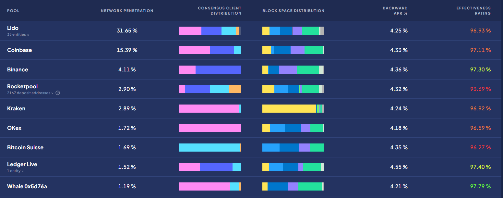

# Roles of a node operator

## What do validator nodes actually do?

In short, validator nodes on the Ethereum network _**process transactions and secure the network.**_ This is done via the [proof-of-stake ](https://ethereum.org/en/developers/docs/consensus-mechanisms/pos/)consensus mechanism where each validator puts 32 ETH at stake to vouch for the validity of new blocks _- with a bundle of transactions in them -_ that either others or themselves have created.

In exchange for doing the work above, validators receive rewards from both users and the Ethereum protocol directly. However, if validators are **caught acting dishonestly** by other nodes in the network, **their stake is slashed** - forcibly burning their 32 ETH based on the severity of their actions. This mechanism is further explained in the [Rewards and penalties sub-section](rewards-and-penalties.md).

<figure><figcaption>
Source: <a href="https://github.com/flashbots/mev-boost">https://github.com/flashbots/mev-boost</a>
</figcaption></figure>

Let's examine the value chain of the ETH validator network to understand this process in more detail.

1. When users interact with Dapps built on Ethereum or send assets to one another, their transactions will first be sent into a holding area called the Mempool.
2. Block Builders retrieve these transactions by _**observing the Mempool directly**_ or _**working with MEV searchers**_ to bundle them into blocks before sending them to the validator network via Relays. We can ignore the Private Orderflow mechanism for the scope of this guide.
3. Validators communicate with the Relays by running the mev-boost service, which serves as a marketplace for Block Builders to bid for their blocks' inclusion in the next earliest slot.
   * This bidding mechanism results in most of the value from MEV flowing to validators.
   * Validators may also build blocks locally by pulling transactions directly from the Mempool.
4. For every epoch (6.4 minutes), 32 validators are chosen randomly as block proposers, each proposing a block in their assigned \~12-second slots.
5. This block proposer has \~4 seconds to receive, execute, and send the block back out.
6. A committee of validators (the Beacon Committee) is chosen randomly to determine this new block's validity within the remaining \~8 seconds.
7. Once the new block is proposed and sufficiently attested to, it is added to the blockchain.
8. At the end of every 2 epochs, all prior transactions are finalised and can no longer be reversed without burning a large portion of staked ETH across the whole network.
